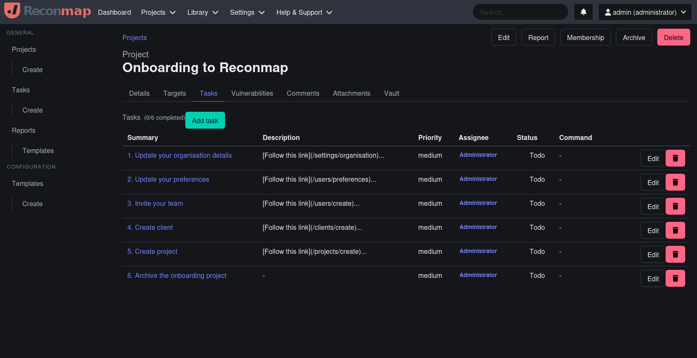

<div style="text-align: center;">

<h1>Reconmap</h1>

[](https://bsky.app/profile/netfoe.com)
[](https://www.youtube.com/reconmap)
[](https://gitter.im/reconmap/community)

<h3>Pentesting Management, Automation and Reporting Platform</h3>
</div>

<p><strong>Reconmap</strong> is an open source vulnerability assessment and penetration testing platform designed to support security professionals throughout the entire engagement lifecycle. It enables penetration testers and InfoSec teams to efficiently plan, execute, and report on security assessments.</p>

<p>By streamlining workflows and promoting collaboration, Reconmap helps reduce the time from initial reconnaissance to final reporting — delivering faster, more organised results without compromising quality.</p>



## Capabilities

- Execute security commands instantly or schedule them for later
- Automatically capture and store command outputs while tracking identified vulnerabilities
- Generate professional reports in formats like Word, Markdown, or LaTeX
- And much more to streamline your security assessments!

## Try it

### Demo instance

Details on how to connect to the live demo server can be found [here](https://reconmap.com/overview/live-demo/).

### Hosted (SaaS)

Allow our developers and architects to host Reconmap for you via our hosted offering https://www.netfoe.com, so that you can focus on delivering value to your customers.

### Run it locally

#### Runtime requirements

- Docker
- [Docker compose](https://docs.docker.com/compose/install/)

#### How to run it locally with Docker compose

1. First you need to start your docker containers:

```sh
docker compose up -d
```

2. After this, open your browser at http://localhost:5500

## Documentation

Go to <https://reconmap.com/> to find the user, admin and developer manuals.

## How to Contribute

We welcome contributions from the community! Here are some ways you can get involved:

- **★ Star this project on GitHub ★** to show your support and help others discover it.
- Review the [documentation](https://reconmap.com) and submit improvements via a pull request to the [documentation repository](https://github.com/reconmap/documentation).
- Share your ideas or suggest new features on the [discussion board](https://github.com/reconmap/reconmap/discussions).
- Contribute to the codebase by improving the [backend](https://github.com/reconmap/rest-api), [frontend](https://github.com/reconmap/web-client), or [CLI tools](https://github.com/reconmap/command-line-tools).
- Report security vulnerabilities or other issues to help us maintain a secure and reliable platform.

Before contributing, please read our [Contributing Guidelines](https://github.com/reconmap/.github/blob/main/CONTRIBUTING.md) to ensure a smooth collaboration process. Thank you for helping make Reconmap better!

## How to report bugs

If you have bugs to report please use the [issues](https://github.com/reconmap/reconmap/issues) tab on Github to submit the details.

If you want to chat to somebody on the development team head to our [Gitter](https://gitter.im/reconmap/community) channel.
