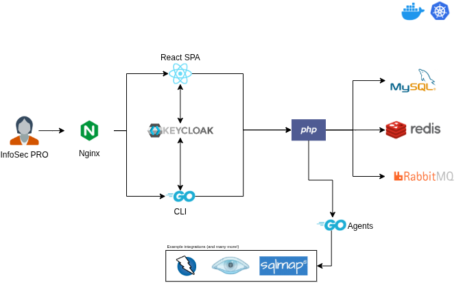

The Reconmap multi-tier architecture was designed to scale and serve anything from small pentesting teams to large infosec organisations. At a high-level it consists of multiple clients (web and command line) that communicate to a Rest API to get and process information. Data is stored permanently in a PostgreSQL database, and a Redis service is used to cache information.

A keycloak identity service (Open ID connect) is used to authenticate users and JWT tokens are also used for service to service communication.

### Authorization & Service Accounts

Centralized authorization is enforced via **Open Policy Agent (OPA)** rules integrated with the C# REST API through `OpaActionFilter`. 

- **Regular Users:** Authenticated users are resolved to database records in the `user` table. Their roles and permissions are queried to validate requests.
- **Service Accounts (Agents):** Reconmap agent clients (`reconmapd`) authenticate via OAuth Client Credentials grant. Because they are machine accounts and do not exist in the database `user` table, the API bypasses the database user lookup during authorization check and maps them to a virtual Administrator user. This ensures agents can successfully execute their boot, ping, and check-in endpoints.

### Tenant data access

OPA grants only explicitly named endpoint capabilities; it never treats a missing `project_id` as authorization. Collection and indirect-resource endpoints additionally use the API's request access scope, which resolves the caller's project memberships and applies them to every database query.

- Users and clients can access project data only in projects where they are members.
- Users can access vault secrets they own or secrets associated with one of their projects. Clients cannot access the vault.
- Notifications are visible and mutable only by their recipient.
- Attachments and notes must resolve through a project, task, vulnerability, or non-template report in a member project. Unscoped attachment parents are administrator-only.
- Jira/Azure DevOps integration configuration and system data import/export are administrator-only. Integration API tokens and personal access tokens are never included in API responses.

The last part of this architecture is Rabbitmq, a message queue and broker. This queue handles heavy or asynchronous background tasks like sending report emails and generating reports asynchronously.

_The diagram above was created from code using [draw.io](https://www.drawio.com/). See the source [here](../../diagrams/reconmap-high-level-architecture.drawio)._
